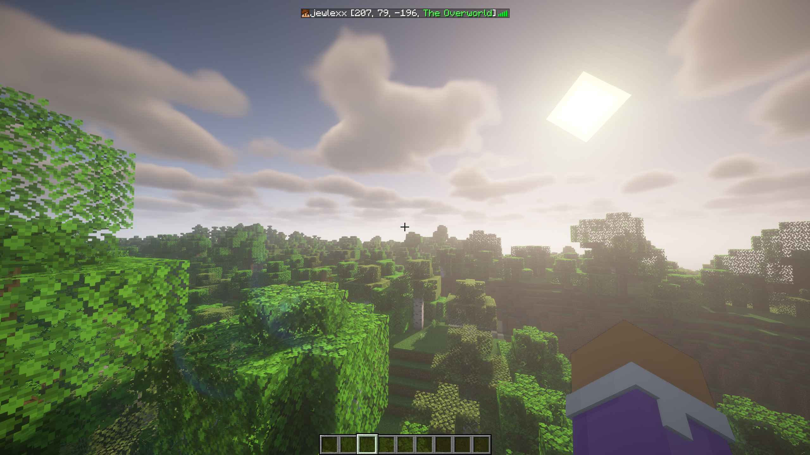

# TabLocation

Adds the players location to their tab name, so you can see where they are by pressing tab at any time.

TabLocation supports some player list plugins such as TAB. Setup for this can be found in [the Wiki](https://github.com/jewlexx/TabLocation/wiki/TAB-Setup).

## Building

- Install maven
- Run `./gradlew shadowJar` to build the plugin JAR file

**Made with 💗 by Juliette Cordor**
